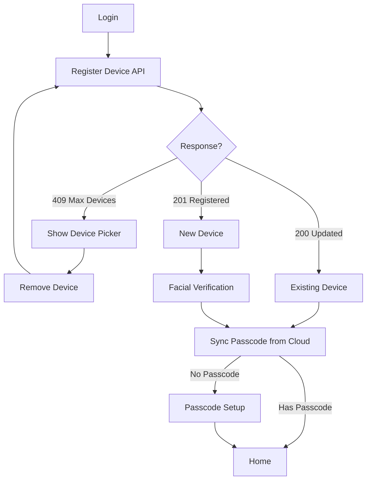

# Device Management - AWS Setup Guide

## Overview

This document outlines the AWS infrastructure for device management with:
- 3-device limit per user
- Facial verification for new devices
- Cross-device passcode sync
- Automatic logout on passcode change

| Resource | Value |
|----------|-------|
| API Name | `thryve-api` |
| Base URL | `https://qeia3tvvg7.execute-api.us-east-1.amazonaws.com/prod` |
| Stage | `prod` |
| Region | `us-east-1` |

---

## 1. DynamoDB Table: `thryve-user-devices`

### Create Table

```bash
aws dynamodb create-table \
  --table-name thryve-user-devices \
  --attribute-definitions \
    AttributeName=user_id,AttributeType=S \
    AttributeName=device_id,AttributeType=S \
  --key-schema \
    AttributeName=user_id,KeyType=HASH \
    AttributeName=device_id,KeyType=RANGE \
  --billing-mode PAY_PER_REQUEST
```

### Schema

| Field | Type | Description |
|-------|------|-------------|
| `user_id` | String (PK) | Cognito user ID |
| `device_id` | String (SK) | Unique device identifier |
| `device_name` | String | e.g., "iPhone 15 Pro" |
| `platform` | String | "ios" or "android" |
| `location` | String | City, Country from IP |
| `last_login` | String | ISO timestamp |
| `created_at` | String | ISO timestamp |

---

## 2. Lambda Function: `thryve-device-management`

### Endpoints

| Method | Path | Action |
|--------|------|--------|
| POST | `/user/devices` | Register device on login |
| GET | `/user/devices` | List user's devices |
| DELETE | `/user/devices/{device_id}` | Remove a device |

### Response Status

| Status | Meaning | Frontend Action |
|--------|---------|-----------------|
| `registered` (201) | New device added | Require facial verification |
| `updated` (200) | Existing device | Skip to passcode check |
| `max_devices` (409) | 3 devices limit | Show device picker |

### Lambda Code (Python)

```python
import json
import boto3
import urllib.request
from datetime import datetime

dynamodb = boto3.resource('dynamodb')
table = dynamodb.Table('thryve-user-devices')
MAX_DEVICES = 3

def lambda_handler(event, context):
    print(f"Full event: {json.dumps(event)}")  # Debug log
    
    try:
        request_context = event.get('requestContext', {})
        authorizer = request_context.get('authorizer', {})
        claims = authorizer.get('claims', {})
        user_id = claims.get('sub')
        
        if not user_id:
            return response(401, {'error': 'Unauthorized - no user ID'})
        
        http_method = event.get('httpMethod', '')
        client_ip = request_context.get('identity', {}).get('sourceIp', '')
        
        if http_method == 'GET':
            return get_devices(user_id)
        elif http_method == 'POST':
            body = json.loads(event.get('body', '{}'))
            location = get_location_from_ip(client_ip)
            return register_device(user_id, body, location)
        elif http_method == 'DELETE':
            device_id = event.get('pathParameters', {}).get('device_id', '')
            return delete_device(user_id, device_id)
        else:
            return response(400, {'error': f'Unsupported method: {http_method}'})
    except Exception as e:
        print(f"Error: {str(e)}")
        return response(500, {'error': str(e)})

def get_location_from_ip(ip):
    try:
        if not ip or ip == '127.0.0.1':
            return 'Unknown'
        url = f'http://ip-api.com/json/{ip}?fields=city,country'
        with urllib.request.urlopen(url, timeout=2) as resp:
            data = json.loads(resp.read().decode())
            city = data.get('city', '')
            country = data.get('country', '')
            if city and country:
                return f'{city}, {country}'
            return country or 'Unknown'
    except:
        return 'Unknown'

def get_devices(user_id):
    result = table.query(
        KeyConditionExpression='user_id = :uid',
        ExpressionAttributeValues={':uid': user_id}
    )
    return response(200, {'devices': result['Items']})

def register_device(user_id, body, location):
    devices = table.query(
        KeyConditionExpression='user_id = :uid',
        ExpressionAttributeValues={':uid': user_id}
    )['Items']
    
    for d in devices:
        if d['device_id'] == body['device_id']:
            table.update_item(
                Key={'user_id': user_id, 'device_id': body['device_id']},
                UpdateExpression='SET last_login = :t, #loc = :l',
                ExpressionAttributeNames={'#loc': 'location'},
                ExpressionAttributeValues={
                    ':t': datetime.utcnow().isoformat(),
                    ':l': location
                }
            )
            return response(200, {'status': 'updated'})
    
    if len(devices) >= MAX_DEVICES:
        return response(409, {
            'error': 'max_devices_reached',
            'devices': devices,
            'message': 'Maximum 3 devices. Remove one to continue.'
        })
    
    table.put_item(Item={
        'user_id': user_id,
        'device_id': body['device_id'],
        'device_name': body['device_name'],
        'platform': body['platform'],
        'location': location,
        'last_login': datetime.utcnow().isoformat(),
        'created_at': datetime.utcnow().isoformat()
    })
    return response(201, {'status': 'registered'})

def delete_device(user_id, device_id):
    table.delete_item(Key={'user_id': user_id, 'device_id': device_id})
    return response(200, {'status': 'deleted'})

def response(status, body):
    return {
        'statusCode': status,
        'headers': {
            'Content-Type': 'application/json',
            'Access-Control-Allow-Origin': '*'
        },
        'body': json.dumps(body)
    }
```

---

## 3. API Gateway Configuration

### Resources Structure
```
/
└── /user
    ├── /devices
    │   ├── GET    → thryve-device-management
    │   ├── POST   → thryve-device-management
    │   └── /{device_id}
    │       └── DELETE → thryve-device-management
    └── /profile
        └── GET    → thryve-get-user-profile
```

### Each Method Requires
- **Authorization**: Cognito User Pool Authorizer
- **Integration**: Lambda Proxy Integration ✅

---

## 4. Login Flow



---

## 5. Cross-Device Passcode Sync

When passcode is changed on Device A:

1. **PinService.setPin()** saves hash to Cognito
2. **DeviceService.logoutOtherDevices()** removes all other devices from DynamoDB
3. Device B opens app → **SessionService** checks registration
4. Device B not found → **fullLogout()** clears tokens + passcode
5. User redirected to login → facial verification → sync new passcode

### Key Methods

| Service | Method | Purpose |
|---------|--------|---------|
| `DeviceService` | `isDeviceRegistered()` | Check if current device in DynamoDB |
| `DeviceService` | `logoutOtherDevices()` | Remove all other devices |
| `SessionService` | `fullLogout()` | Clear tokens + passcode + session |
| `PinService` | `syncFromCloud()` | Fetch passcode hash from Cognito |

---

## 6. Flutter Files Modified

| File | Change |
|------|--------|
| `device_service.dart` | Added `isNewDevice`, `isDeviceRegistered()`, `logoutOtherDevices()` |
| `session_service.dart` | Device check on init + resume, `fullLogout()` |
| `auth_state.dart` | Added `AuthNeedsFacialVerification` |
| `auth_bloc.dart` | Check `isNewDevice`, emit facial state |
| `login_page.dart` | Handle facial verification navigation |
| `facial_verification_page.dart` | Placeholder page |
| `splash_page.dart` | Re-check isLoggedIn after delay |
| `security_page.dart` | Display devices with location |
| `router.dart` | Added `/facial-verification` route |

---

## 7. Facial Verification (TODO)

The facial verification page is a placeholder. To implement:

1. Integrate camera package (`camera: ^0.10.x`)
2. Use face detection SDK (Google ML Kit or AWS Rekognition)
3. Compare with stored face template
4. Store face template on first registration

---

*Updated: December 29, 2024*
