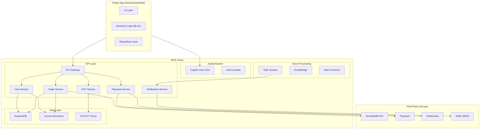
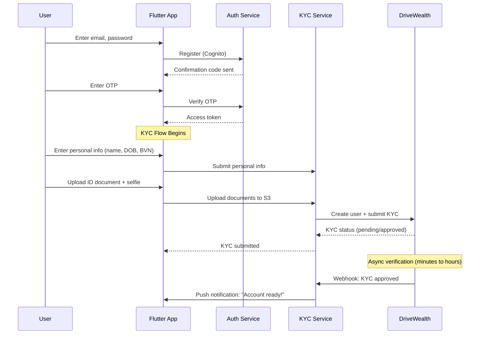
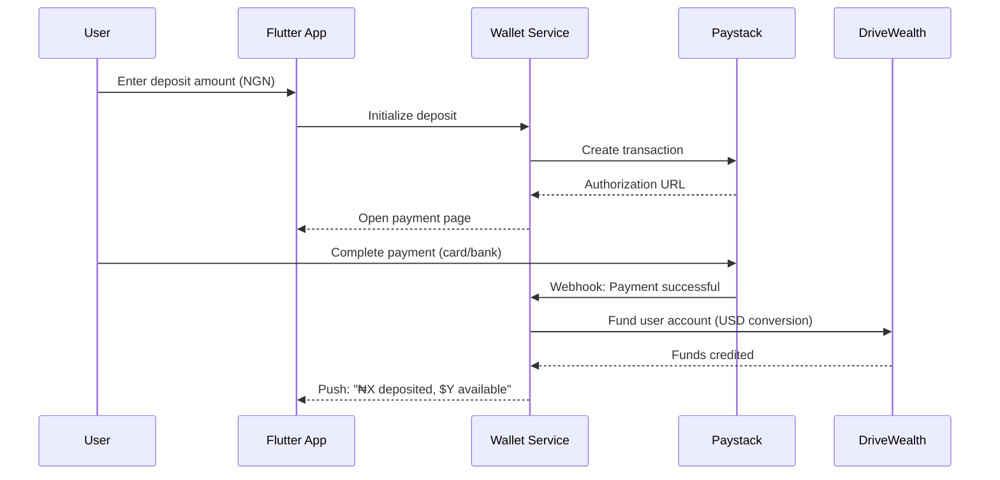
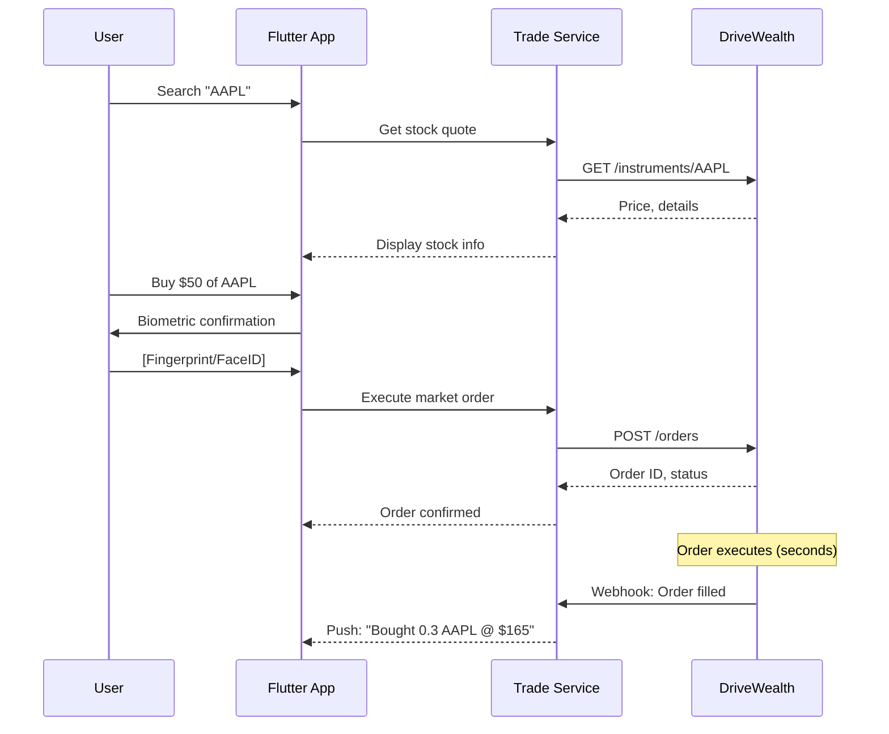
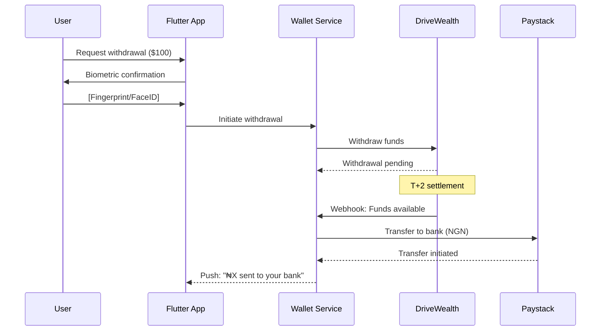

# Thryve Mobile App - Technical Architecture Plan

> **Investment platform enabling Nigerians to invest in US stocks via DriveWealth brokerage**

## Executive Summary

| Aspect | Choice |
|--------|--------|
| **Frontend** | Flutter 3.x (iOS, Android, Web) |
| **Backend** | Python 3.11+ on AWS Lambda |
| **Database** | DynamoDB (primary) + Aurora Serverless (transactions) |
| **Auth** | AWS Cognito + Biometric (local) |
| **Brokerage** | DriveWealth API |
| **Payments** | Paystack (primary), Flutterwave (backup) |
| **Notifications** | AWS SNS (Push), Twilio (SMS), SES (Email) |

---

## User Review Required

> [!IMPORTANT]
> **DriveWealth Partnership**: DriveWealth requires a partnership agreement and sandbox access before development. Have you initiated this process? If not, this is a **critical path blocker**.

> [!WARNING]
> **Regulatory Compliance**: Operating an investment platform in Nigeria may require SEC Nigeria registration. I recommend consulting a fintech lawyer before launch.

> [!CAUTION]
> **2-Month Timeline**: This is aggressive for a production investment app. I recommend a phased approach—launching with limited features first, then iterating.

---

## System Architecture



---

## AWS Services Breakdown

### Compute & API
| Service | Purpose | Cost Estimate (Monthly) |
|---------|---------|------------------------|
| **API Gateway** | REST API endpoints with throttling | ~$3.50/million requests |
| **Lambda** | Python microservices | ~$0.20/million invocations |
| **Step Functions** | Orchestrate KYC, withdrawals | ~$25/million transitions |

### Data Storage
| Service | Purpose | Why |
|---------|---------|-----|
| **DynamoDB** | User profiles, portfolios, sessions | Fast key-value access, scales to zero |
| **Aurora Serverless v2** | Transaction ledger, audit logs | ACID compliance for financial data |
| **S3** | KYC documents, app assets | Durable, cheap storage |
| **ElastiCache (Redis)** | Session cache, rate limiting | Sub-ms response for auth tokens |

### Security
| Service | Purpose |
|---------|---------|
| **Cognito** | User authentication, MFA |
| **Secrets Manager** | API keys (DriveWealth, Paystack) |
| **WAF** | Rate limiting, bot protection |
| **KMS** | Encrypt sensitive data at rest |

### Messaging & Events
| Service | Purpose |
|---------|---------|
| **SQS** | Async processing (notifications, webhooks) |
| **SNS** | Push notifications |
| **SES** | Transactional emails |
| **EventBridge** | Event-driven architecture |

---

## Flutter App Architecture

### Project Structure (Feature-First Clean Architecture)
```
lib/
├── main.dart
├── app/
│   ├── app.dart                    # MaterialApp configuration
│   ├── router.dart                 # GoRouter navigation
│   └── theme/
│       ├── app_theme.dart          # Light/dark themes
│       ├── colors.dart             # Thryve color palette
│       └── typography.dart         # Inter, Space Grotesk
│
├── core/
│   ├── di/                         # Dependency injection (get_it)
│   ├── network/                    # Dio client, interceptors
│   ├── storage/                    # Secure storage, Hive
│   ├── utils/                      # Formatters, validators
│   └── error/                      # Failure classes
│
├── features/
│   ├── auth/
│   │   ├── data/
│   │   │   ├── datasources/        # Remote & local
│   │   │   ├── models/             # DTOs
│   │   │   └── repositories/       # Impl
│   │   ├── domain/
│   │   │   ├── entities/           # User, Session
│   │   │   ├── repositories/       # Abstract
│   │   │   └── usecases/           # Login, Register, BiometricAuth
│   │   └── presentation/
│   │       ├── bloc/               # AuthBloc
│   │       ├── pages/              # LoginPage, RegisterPage
│   │       └── widgets/            # OTPInput, BiometricButton
│   │
│   ├── kyc/                        # KYC verification flow
│   ├── portfolio/                  # Dashboard, holdings
│   ├── trading/                    # Stock search, buy/sell
│   ├── wallet/                     # Deposits, withdrawals
│   └── profile/                    # Settings, account
│
└── shared/
    ├── widgets/                    # Buttons, cards, inputs
    └── constants/                  # API endpoints, keys
```

### Key Flutter Packages
| Package | Purpose |
|---------|---------|
| `flutter_bloc` | State management |
| `go_router` | Declarative navigation |
| `dio` | HTTP client with interceptors |
| `get_it` + `injectable` | Dependency injection |
| `flutter_secure_storage` | Secure credential storage |
| `local_auth` | Biometric authentication |
| `fl_chart` | Portfolio charts |
| `image_picker` + `camera` | KYC document capture |
| `firebase_messaging` | Push notifications |
| `freezed` + `json_serializable` | Immutable models |

---

## Python Backend Structure

### Microservices Architecture
```
backend/
├── shared/
│   ├── models/                     # Pydantic models
│   ├── utils/                      # Common utilities
│   ├── exceptions/                 # Custom exceptions
│   └── middleware/                 # Auth, logging
│
├── services/
│   ├── auth/
│   │   ├── handler.py              # Lambda handlers
│   │   ├── service.py              # Business logic
│   │   └── cognito_client.py       # Cognito operations
│   │
│   ├── user/
│   │   ├── handler.py
│   │   ├── service.py
│   │   └── repository.py           # DynamoDB operations
│   │
│   ├── kyc/
│   │   ├── handler.py
│   │   ├── service.py
│   │   ├── document_processor.py   # S3 upload, verification
│   │   └── drivewealth_kyc.py      # DriveWealth KYC sync
│   │
│   ├── trading/
│   │   ├── handler.py
│   │   ├── service.py
│   │   ├── drivewealth_client.py   # API wrapper
│   │   └── market_data.py          # Stock prices, charts
│   │
│   ├── wallet/
│   │   ├── handler.py
│   │   ├── service.py
│   │   ├── paystack_client.py
│   │   └── flutterwave_client.py
│   │
│   └── notifications/
│       ├── handler.py
│       ├── service.py
│       └── providers/              # SNS, Twilio, SES
│
├── infrastructure/
│   ├── template.yaml               # SAM template
│   ├── api.yaml                    # OpenAPI spec
│   └── events.yaml                 # EventBridge rules
│
└── tests/
```

### Key Python Packages
| Package | Purpose |
|---------|---------|
| `pydantic` | Data validation |
| `boto3` | AWS SDK |
| `httpx` | Async HTTP client |
| `mangum` | ASGI adapter for Lambda |
| `python-jose` | JWT handling |
| `pytest` | Testing |

---

## User Flows

### 1. Signup & KYC Flow


### 2. Deposit Flow (Paystack)


### 3. Trade Execution Flow


### 4. Withdrawal Flow


---

## Database Schema

### DynamoDB Tables

#### Users Table
| Attribute | Type | Description |
|-----------|------|-------------|
| `PK` | String | `USER#<user_id>` |
| `SK` | String | `PROFILE` |
| `email` | String | User email |
| `phone` | String | Nigerian phone (+234) |
| `drivewealth_user_id` | String | DW account reference |
| `kyc_status` | String | `pending`, `approved`, `rejected` |
| `created_at` | String | ISO timestamp |

#### Transactions Table (Aurora)
```sql
CREATE TABLE transactions (
    id UUID PRIMARY KEY,
    user_id UUID NOT NULL,
    type VARCHAR(20) NOT NULL,  -- deposit, withdrawal, buy, sell
    amount DECIMAL(18, 8) NOT NULL,
    currency VARCHAR(3) NOT NULL,
    status VARCHAR(20) NOT NULL,
    external_ref VARCHAR(100),   -- Paystack/DW reference
    created_at TIMESTAMP DEFAULT NOW(),
    updated_at TIMESTAMP DEFAULT NOW()
);
```

---

## Design System (Match Website)

### Color Palette
```dart
class ThryveColors {
  // Primary
  static const accent = Color(0xFFF37021);       // Hermes Orange
  static const accentLight = Color(0xFFFF9F5E);
  
  // Neutrals (Light Mode)
  static const background = Color(0xFFF8FAFC);
  static const surface = Color(0xFFF1F5F9);
  static const text = Color(0xFF0F172A);
  static const textSecondary = Color(0xFF64748B);
  
  // Semantic
  static const success = Color(0xFF10B981);      // Green for gains
  static const error = Color(0xFFEF4444);        // Red for losses
  
  // Glass effect
  static final glass = Colors.white.withOpacity(0.6);
}
```

### Typography
```dart
class ThryveTypography {
  static const fontFamily = 'Inter';
  static const displayFamily = 'Space Grotesk';
  
  static const headlineLarge = TextStyle(
    fontFamily: displayFamily,
    fontSize: 32,
    fontWeight: FontWeight.w700,
  );
  
  static const bodyMedium = TextStyle(
    fontFamily: fontFamily,
    fontSize: 14,
    fontWeight: FontWeight.w400,
  );
}
```

---

## Security Considerations

| Concern | Mitigation |
|---------|------------|
| **API Security** | JWT tokens, API Gateway throttling, WAF |
| **Data at Rest** | KMS encryption for DynamoDB, S3 |
| **Data in Transit** | TLS 1.3, certificate pinning |
| **Secrets** | AWS Secrets Manager, no hardcoded keys |
| **Biometrics** | Local-only, never transmitted |
| **PII** | Encrypt BVN, limit data exposure |
| **Audit Trail** | All financial operations logged to Aurora |

---

## Proposed Timeline (8 Weeks)

| Week | Focus | Deliverables |
|------|-------|--------------|
| **1** | Setup & Infrastructure | AWS accounts, Flutter project, CI/CD |
| **2** | Auth & User Service | Signup, login, Cognito, biometrics |
| **3** | KYC Integration | Document upload, DriveWealth KYC |
| **4** | DriveWealth Trading | Market data, buy/sell orders |
| **5** | Payments | Paystack deposits, withdrawals |
| **6** | Portfolio & Dashboard | Holdings, charts, history |
| **7** | Polish & Notifications | Push/SMS/Email, error handling |
| **8** | Testing & Submission | QA, security review, app stores |

---

## Verification Plan

### Automated Tests
- Unit tests for all services (pytest, flutter_test)
- Integration tests for DriveWealth sandbox
- E2E tests with Flutter integration_test

### Manual Verification
- Test full user journey on real devices
- Payment flow testing with Paystack sandbox
- App store compliance review

---

## Next Steps

1. ✅ Confirm DriveWealth sandbox access
2. ✅ Confirm Paystack account setup
3. Approve this architecture plan
4. Begin Phase 2: Project Setup
